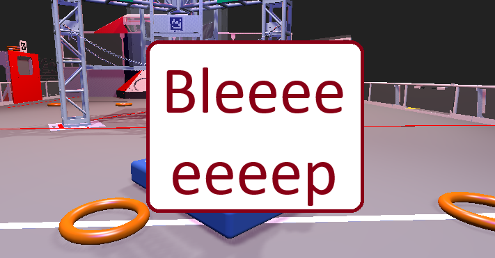
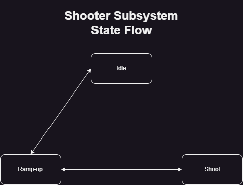
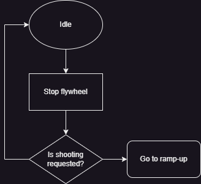

  
  <h3 align="center">[NAME] - Team 401's 2024 Competition Robot</h3>

> :warning: **WIP**: We are still too early in the season to add proper features/details.

# Robot

## About the Robot
Our 2024 robot does X.

Key Features:
* X
* X
* X

## Drivetrain

## Intake

## Scoring
The scoring subsystem has one state machine that controls both the aimer and the shooter. Below is a past version with two separate control flows.

### Shooter
 

### Aimer
X

## Endgame

## Nav

## Auto

## Sim

## UX

## AdvantageScope Model
### How to configure locally
1. Run `advantagescope-configs\autoconfig-windows.bat` (`advantagescope-configs\autoconfig-linux.sh` for linux) to automagically copy robot models and config files.
2. Click `File -> Import Layout...` and open `advantagescope-configs\scope-layout\config.json`.

### How to push your updates to the scope configuration
Click `File -> Export Layout...` and export this into your `advantagescope-configs\scope-layout` folder. Name it `config.json`.

## Roadmap
- [ ] Minimum Viable Autonomous
- [ ] Advanced Autonomous
- [ ] Elite Autonomous

## Contact
TBD
