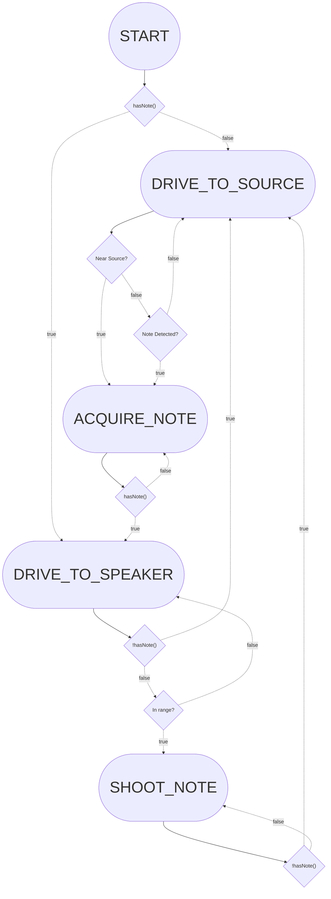

# AutomatedTeleop Subsystem

```mermaid
flowchart TD

classDef state font-size:40px,padding:10px

node0:::state
node0([<font size=11>START])
node1:::state
node1([<font size=11>DRIVE_TO_SOURCE])
node2:::state
node2([<font size=11>ACQUIRE_NOTE])
node3:::state
node3([<font size=11>DRIVE_TO_SPEAKER])
node4:::state
node4([<font size=11>SHOOT_NOTE])
node0 --> node5
node5 -.->|false| node1
node5{"hasNote()"}
node5 -.->|true| node3
node1 --> node6
node6{"Near Source?"}
node6 -.->|true| node2
node6 -.->|false| node7 
node7{"Note Detected?"}
node7 -.->|true| node2
node7 -.->|false| node1 
node2 --> node8
node8{"hasNote()"}
node8 -.->|true| node3
node8 -.->|false| node2
node3 --> node9
node9{"!hasNote()"}
node9 -.->|true| node1
node9 -.->|false| node10
node10{"In range?"}
node10 -.->|true| node4
node10 -.->|false| node3
node4 --> node11
node11{"!hasNote()"}
node11 -.->|true| node1
node11 -.->|false| node4
```
