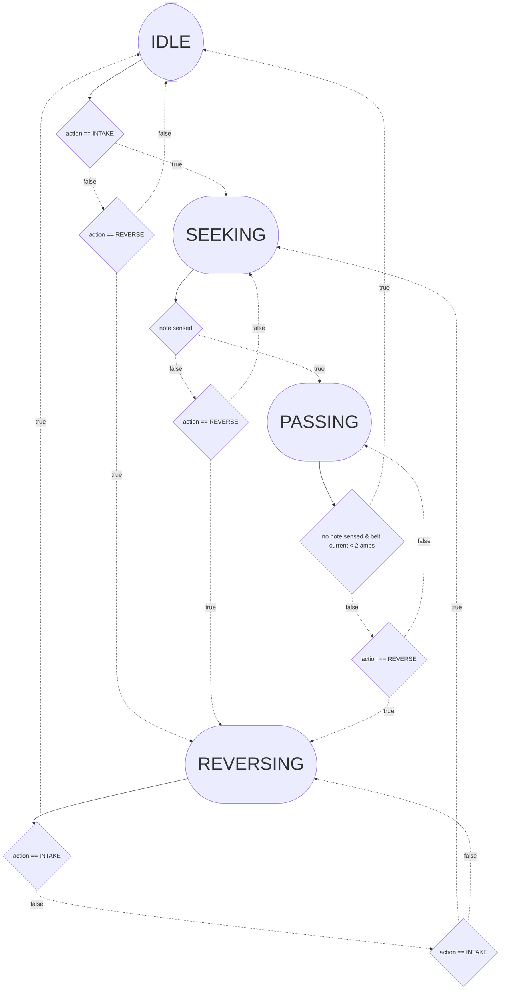

# Intake Subsystem

```mermaid
flowchart TD

classDef state font-size:40px,padding:10px

node0:::state
node0([<font size=11>IDLE])
node1:::state
node1([<font size=11>SEEKING])
node2:::state
node2([<font size=11>PASSING])
node3:::state
node3([<font size=11>REVERSING])
node0 --> node4
node4{"action == INTAKE"}
node4 -.->|true| node1
node4 -.->|false| node5
node5{"action == REVERSE"}
node5 -.->|true| node3
node5 -.->|false| node0
node1 --> node6
node6{"note sensed"}
node6 -.->|true| node2
node6 -.->|false| node7
node7{"action == REVERSE"}
node7 -.->|true| node3
node7 -.->|false| node1
node2 --> node8
node8{"no note sensed & belt current < 2 amps"}
node8 -.->|true| node0
node8 -.->|false| node9
node9{"action == REVERSE"}
node9 -.->|true| node3
node9 -.->|false| node2
node3 --> node10
node10{"action == INTAKE"}
node10 -.->|true| node0
node10 -.->|false| node11
node11{"action == INTAKE"}
node11 -.->|true| node1
node11 -.->|false| node3
```
