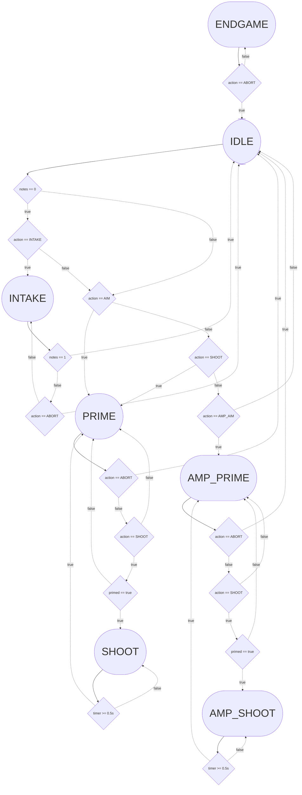

# Scoring Subsystem

```mermaid
flowchart TD

classDef state font-size:40px,padding:10px

node0:::state
node0([<font size=11>IDLE])
node1:::state
node1([<font size=11>INTAKE])
node2:::state
node2([<font size=11>PRIME])
node3:::state
node3([<font size=11>AMP_PRIME])
node4:::state
node4([<font size=11>SHOOT])
node5:::state
node5([<font size=11>AMP_SHOOT])
node6:::state
node6([<font size=11>ENDGAME])
node0 --> node7
node7{"notes == 0"}
node7 -.->|true| node9
node7 -.->|false| node8 
node9{"action == INTAKE"}
node9 -.->|true| node1
node9 -.->|false| node8 
node8{"action == AIM"}
node8 -.->|true| node2
node8 -.->|false| node11 
node11{"action == SHOOT"}
node11 -.->|true| node2
node11 -.->|false| node10 
node10{"action == AMP_AIM"}
node10 -.->|true| node3
node10 -.->|false| node0
node1 --> node12
node12{"notes == 1"}
node12 -.->|true| node0
node12 -.->|false| node13 
node13{"action == ABORT"}
node13 -.->|true| node0
node13 -.->|false| node1 
node2 --> node14
node14{"action == ABORT"}
node14 -.->|true| node0
node14 -.->|false| node15
node15{"action == SHOOT"}
node15 -.->|true| node16
node15 -.->|false| node2 
node16{"primed == true"}
node16 -.->|true| node4
node16 -.->|false| node2 
node3 --> node17
node17{"action == ABORT"}
node17 -.->|true| node0
node17 -.->|false| node18
node18{"action == SHOOT"}
node18 -.->|true| node19
node18 -.->|false| node3 
node19{"primed == true"}
node19 -.->|true| node5
node19 -.->|false| node3 
node4 --> node20
node20{"timer >= 0.5s"}
node20 -.->|true| node2
node20 -.->|false| node4
node5 --> node21
node21{"timer >= 0.5s"}
node21 -.->|true| node3
node21 -.->|false| node5
node6 --> node22
node22{"action == ABORT"}
node22 -.->|true| node0
node22 -.->|false| node6
```
