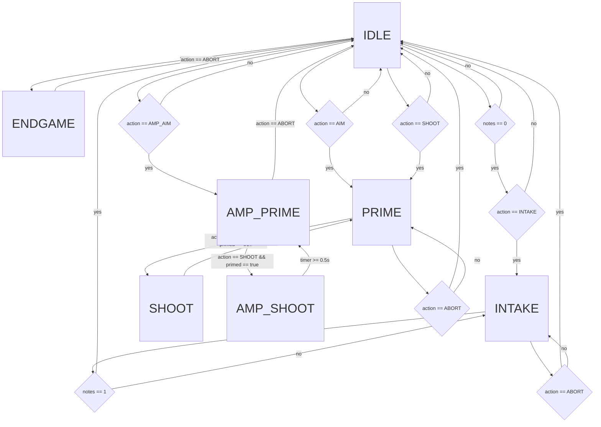

# Scoring Subsystem

```mermaid
flowchart

classDef state font-size:40px,padding:10px

IDLE:::state
INTAKE:::state
PRIME:::state
AMP_PRIME:::state
SHOOT:::state
AMP_SHOOT:::state
ENDGAME:::state

notes_0{notes == 0}
IDLE --> notes_0
notes_0 -->|yes| action_intake
notes_0 -->|no| IDLE
action_intake{action == INTAKE}
action_intake -->|yes| INTAKE
action_intake -->|no| IDLE
IDLE --> action_aim
IDLE --> action_shoot
action_aim{action == AIM}
action_shoot{action == SHOOT}
action_aim -->|yes| PRIME
action_aim -->|no| IDLE
action_shoot -->|yes| PRIME
action_shoot -->|no| IDLE

IDLE --> action_amp_aim
action_amp_aim{action == AMP_AIM}
action_amp_aim -->|yes| AMP_PRIME
action_amp_aim -->|no| IDLE

IDLE -->|TBD| ENDGAME

INTAKE --> notes_1
INTAKE --> action_abort
notes_1{notes == 1}
notes_1 -->|yes| IDLE
notes_1 -->|no| INTAKE
action_abort{action == ABORT}
action_abort -->|yes| IDLE
action_abort -->|no| INTAKE

PRIME --> action_abort2
action_abort2{action == ABORT}
action_abort2 -->|yes| IDLE
action_abort2 -->|no| PRIME
PRIME -->|action == SHOOT && primed == true| SHOOT

AMP_PRIME -->|action == ABORT| IDLE
AMP_PRIME -->|action == SHOOT && primed == true| AMP_SHOOT

SHOOT -->|timer >= 0.5s| PRIME

AMP_SHOOT -->|timer >= 0.5s| AMP_PRIME

ENDGAME -->|action == ABORT| IDLE
```
